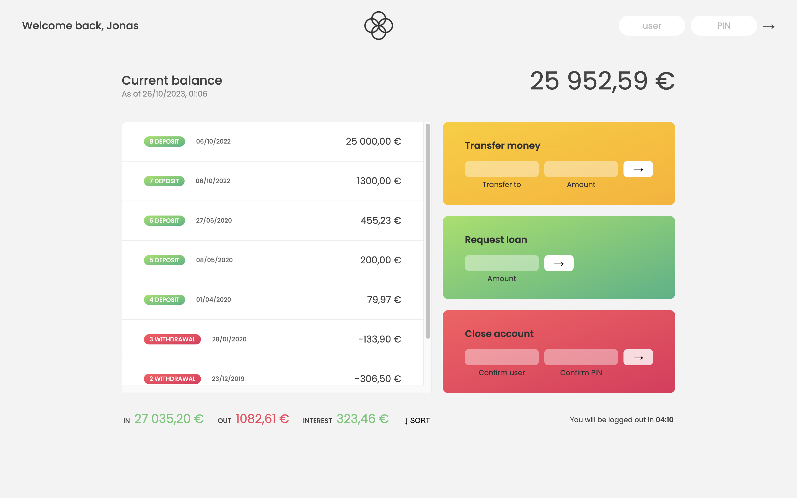

# 🧮 Bankist Calculator

Introducing Bankist Calculator: Simplify Your Finances. Our user-friendly interface and comprehensive features make managing loans, transfers, and account closures effortless. Input loan amount, select repayment period, and get instant calculations. Transfer funds securely between accounts with just a few clicks. Initiate account closure requests seamlessly. Your data is protected with advanced encryption. Experience the Bankist difference today.

Click [here](https://rajeev-bankist-calculator.netlify.app/) and Enjoy the Bankist.

  
  

## Features and Interfaces

- Login functionaliy.

- Money Transfer in quick succession.

- Loan Request in seconds.

- Close account only by one click.

- Sorting functionaliy for sort transations.

- Automatic account off functionality.

## Useful Links

- [Project Demo](https://rajeev-bankist-calculator.netlify.app/) for Web version

- [Project Repository](https://github.com/Rajeevjewar/BankistCalculator.git)

## Need help?

Feel free to contact me on [Twitter](https://twitter.com/be_rajeevkumar) or [LinkedIn](https://www.linkedin.com/in/berajeevkumar/), know more about me at [iamrajeev.me](https://iamrajeev.me)

<h1 align=center>Happy Coding 👨‍💻</h1>

Show some ❤️&nbsp; by giving the star to this repo
